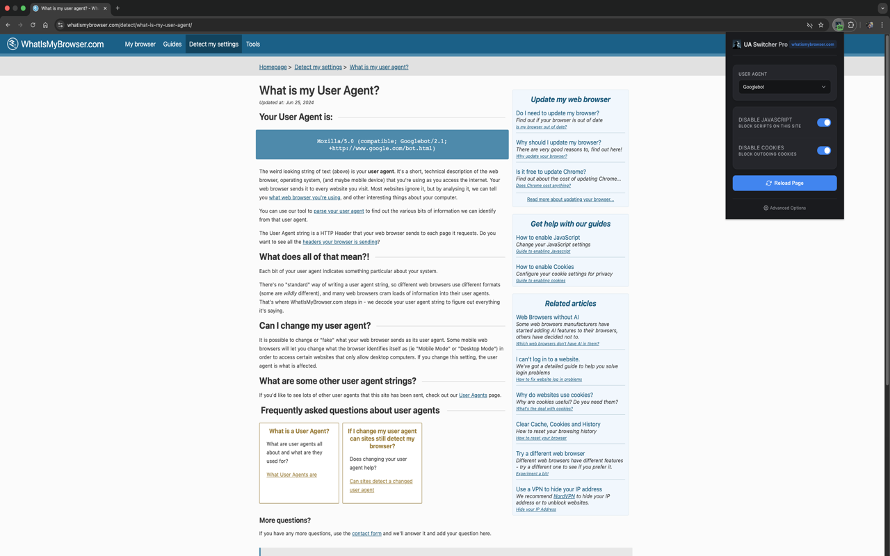

<p align="center">
   
</p>

# User Agent and JS Manager

User Agent and JS Manager is a powerful Chrome extension designed to give you full control over your browsing identity and environment. Easily switch your User-Agent string, manage JavaScript execution, and control cookies on a per-site basis.

[Download from the Chrome Web Store](https://chromewebstore.google.com/detail/user-agent-and-js-manager/jpfikdpcedjmdadbiihkneebogfdadgb)


## Features

- **Advanced User-Agent Switching**: Instantly switch between a wide range of User-Agents, including search engine bots (Googlebot, Bingbot), social media bots (Twitterbot, Facebook), and various desktop/mobile browsers.
- **Per-Site Configuration**: Set specific rules for individual websites. The extension remembers your preferences and automatically applies them when you visit the site.
- **JavaScript Control**: Toggle JavaScript execution for specific domains to enhance privacy, performance, or bypass certain scripts.
- **Cookie Control**: Block outgoing cookies for specific sites to test privacy and authentication scenarios. Incoming cookies from servers are still accepted and stored.
- **Modern Interface**: A sleek, dark-themed UI designed for ease of use and quick access to essential settings.

## Installation

1. **Clone the repository:**
   ```bash
   git clone https://github.com/alex12058/user-agent-and-js-manager.git
   ```
2. **Open Chrome Extensions:**
   Navigate to `chrome://extensions/` in your Chrome browser.
3. **Enable Developer Mode:**
   Toggle the "Developer mode" switch in the top right corner of the page.
4. **Load Unpacked Extension:**
   Click the "Load unpacked" button and select the `extension` directory from the cloned repository.


## Usage

1. **Popup Menu**: Click the extension icon in your browser toolbar to access the quick settings popup.
   - Select a User-Agent from the dropdown to spoof your identity.
   - Toggle "Disable JavaScript" to block scripts for the current site.
   - Toggle "Disable Cookies" to block outgoing cookies for the current site.
   
   

2. **Options Page**: Right-click the extension icon and select "Options" to view and manage all your saved per-site configurations.
   
   

## Development

### Project Structure

- `extension/manifest.json`: The extension manifest file.
- `extension/background.js`: Service worker for handling web requests and storage.
- `extension/popup.html` & `popup.js`: The popup user interface.
- `extension/options.html` & `options.js`: The options page for advanced settings.

## Privacy & Permissions

This extension operates entirely locally. No browsing data is tracked or collected.

- **DeclarativeNetRequest**: Used to modify HTTP headers (User-Agent, Cookie, Referer).
- **ContentSettings**: Used to control JavaScript execution per site.
- **Storage**: Used to save your site-specific preferences.
- **Tabs**: Used to identify the current website and manage tab-specific settings.

## License

This project is licensed under the MIT License - see the [LICENSE](LICENSE) file for details.
